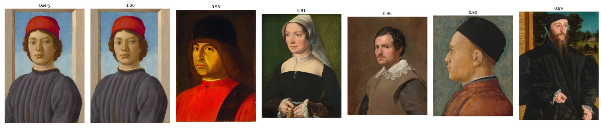
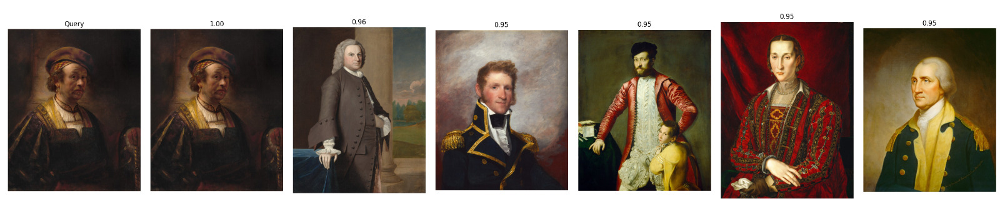
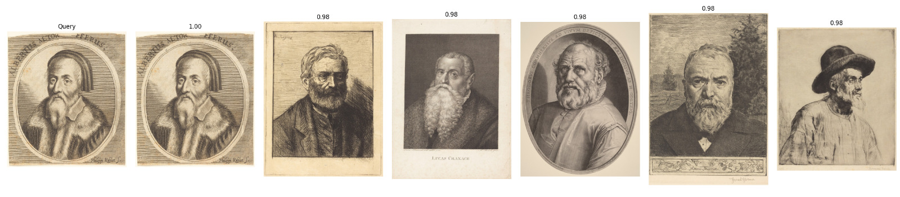
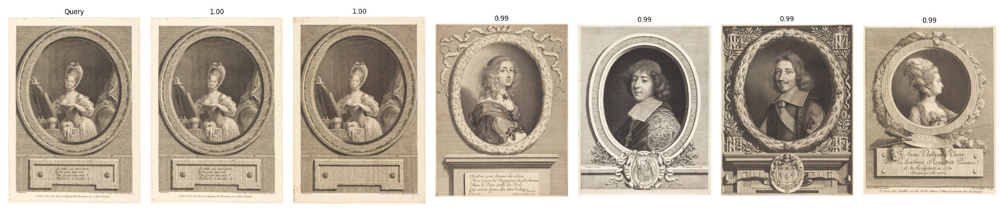
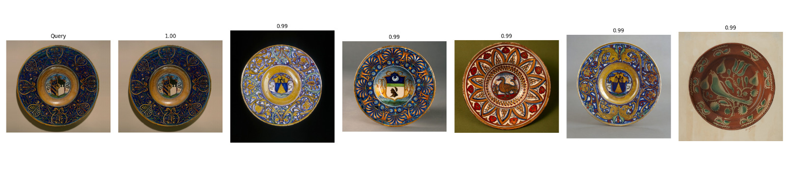

# image-similarity
This project implements a Content-Based Image Retrieval (CBIR) system designed to find visual similarities in historical paintings and artworks from the [National Gallery of Art (NGA) Open Data](https://github.com/NationalGalleryOfArt/opendata) collection.
By leveraging a foundational Vision Transformer and metric learning, this system maps artworks into a semantic vector space where visually and contextually similar paintings are clustered together.
## Architecture & Approach
The pipeline is built using PyTorch and FAISS, consisting of four main stages:
1. **Dataset Mining**: Downloads NGA metadata and images, automatically categorizing artworks into 'portraits' and 'non-portraits' to create a balanced dataset.
2. **Contrastive Learning**: Generates anchor, positive, and negative image triplets to train the network on subtle artistic similarities (using easy and hard negative mining).
3. **Deep Feature Extraction**: Utilizes a frozen **DINOv2** (`vitb14`) backbone attached to a custom trainable projection head, optimized using `TripletMarginLoss`.
4. **Vector Search**: Embeddings are L2-normalized and indexed using **FAISS** (Inner Product), allowing for blazingly fast cosine-similarity visual searches.
## Dataset Generation
The dataset is derived from the National Gallery of Art (NGA) Open Data collection. The goal was to create a model capable of distinguishing fine-grained artistic features by focusing on portraits as a primary class, altough this project works good for non portraits too!
1. Data Mining & Filtering

Using scripts/new_download.py, the following steps were taken:

Metadata Integration: Combined objects.csv, published_images.csv, and objects_terms.csv to map artwork metadata to high-resolution IIIF image URLs.

Classification: Artworks were split into two groups: Portraits (identified via "portrait" terms in metadata) and Non-Portraits (landscapes, still life, etc.).

Balancing: To prevent model bias, non-portraits were downsampled to a maximum of 1,500 images per classification (e.g., "Painting", "Print").
2. Triplet Strategy

To train using Triplet Margin Loss, 100,000 unique triplets were generated in src/data/triplets_csv.py using the following selection logic:

    Anchor: A randomly selected image from the Portrait category.

    Positive: A different randomly selected image from the Portrait category. This forces the model to learn shared "portrait" features across different artists and styles.

    Negative: A mix of two strategies to improve model robustness:

        Easy Negatives (70%): A randomly selected Non-Portrait. This teaches the model the basic difference between a human face and a landscape or object.

        Hard Negatives (30%): A different Portrait. This forces the model to distinguish between two different people or artistic styles within the same category, significantly sharpening the embedding accuracy.
## Results

